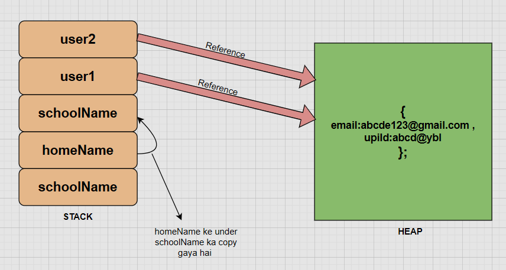

# JAVA_SCRIPT
# n_o_t_e_s

A repo for JavaScript code

[Java Script documentation](https://tc39.es/ecma262/)

- _JS_basic/name.js_
```js
console.log("Prathmesh Chauhan");
```
```js
Prathmesh Chauhan
```

- _JS_basic/variables.js_
```js
// ye constant ye fix hai change nahi ho sakta ✅
const accountId=910118;

// (block scoped, sirf {} block ke andar accessible, mutable, No Re-declaration) ✅
let accountEmail="prathmesh321vns@gmail.com"; 

// (function scoped, sirf function ke andar accessible, mutable, Re-declaration allowed)
var accountFirstMobNum=8081400291;  // ye ek number ki tarah dekha jayega means ispar maths ke operation perform ho sakta hai ❌
var accountSecondMobNum="7626526361"; // ye ek string ki tarah treet hoga ❌

accountState="Uttar Pradesh"; //ye defaultly var datatype mein chala jata hai ❌


console.log(accountId,accountEmail,accountFirstMobNum,accountSecondMobNum,accountState,2332,"adjag");

console.table([accountId,accountEmail,accountFirstMobNum,accountSecondMobNum,accountState]);
```
```js
910118 prathmesh321vns@gmail.com 8081400291 7626526361 Uttar Pradesh 2332 adjag
┌─────────┬─────────────────────────────┐
│ (index) │           Values            │
├─────────┼─────────────────────────────┤
│    0    │           910118            │
│    1    │ 'prathmesh321vns@gmail.com' │
│    2    │         8081400291          │
│    3    │        '7626526361'         │
│    4    │       'Uttar Pradesh'       │
└─────────┴─────────────────────────────┘
```

- _JS_basic/datatypes.js_
```js
let name="Raj"; // string data_type
let number=3232; // integer data_type
let loggedIn=true; // boolean data_type
let state; // undefined 
let temperature=null; // empty hai

// number => integer data_type of range 2^53
// string => "xyz"
// boolean => true / false
// null => stand alone value (object data_type)
// undefined => undefined data_type
//symbol => unique

console.log(state,temperature);

// agar kisi ka data_type pata karna ho to :

console.log(typeof(state)); // undefined
console.log(typeof state); // undefined
console.log(typeof undefined); // undefined
console.log(typeof("Prathmesh")); // string
console.log(typeof(temperature)); // object
console.log(typeof(null)); // object
```
```js
undefined null
undefined
undefined
undefined
string
object
object
```

- _JS_basic/conversionOperation.js_
```js
let a1=23,a2="23",a3="",a4="raj",a5=true,a6=null,a7;   // a7 wala undefined hai
```
```js
// Converting into a Number :
console.table([Number(a1),Number(a2),Number(a3),Number(a4),Number(a5),Number(a6),Number(a7)]);

┌─────────┬────────┐
│ (index) │ Values │
├─────────┼────────┤
│    0    │   23   │
│    1    │   23   │
│    2    │   0    │
│    3    │  NaN   │
│    4    │   1    │
│    5    │   0    │
│    6    │  NaN   │
└─────────┴────────┘
```
```js
// Converting into a string :
console.table([String(a1),String(a2),String(a3),String(a4),String(a5),String(a6),String(a7)]);

┌─────────┬─────────────┐
│ (index) │   Values    │
├─────────┼─────────────┤
│    0    │    '23'     │
│    1    │    '23'     │
│    2    │     ''      │
│    3    │    'raj'    │
│    4    │   'true'    │
│    5    │   'null'    │
│    6    │ 'undefined' │
└─────────┴─────────────┘
```
```js
// Converting into a Boolean :
console.table([Boolean(a1),Boolean(a2),Boolean(a3),Boolean(a4),Boolean(a5),Boolean(a6),Boolean(a7),Boolean(1)]);

┌─────────┬────────┐
│ (index) │ Values │
├─────────┼────────┤
│    0    │  true  │
│    1    │  true  │
│    2    │ false  │
│    3    │  true  │
│    4    │  true  │
│    5    │ false  │
│    6    │ false  │
│    7    │  true  │
└─────────┴────────┘
```

- _JS_basic/operation.js_
```js
let num0=3;
let num1=-num0;
console.log(num1); // -3

console.log("raj"+" suman"); // raj suman

console.log("raj"+2 , 9+"raj"); // raj2 9raj

console.log(3+10+"kali"+8+5); // 13kali85

console.log(4+7); // 11
console.log(4-7); // -3
console.log(4*3); // 12
console.log(4**3); // 64
console.log((-5)**3); // -125
console.log(8%3); // 2
console.log(16/3); // 5.333333333333333
console.log(19.5*4) // 78
console.log(19.5*4.0); //78
console.log(78/4); //19.5
console.log(78.875%4.88); // 0.7950000000000017

let a,b,c;
a=b=c=5;
console.log(a,b,c) // 5 5 5

// seeing POST_INCREMENT & PRE_INCREMENT :

let x1,y1,x2,y2;

x1=6;
y1=x1++;
console.log("\nx1 = ",x1,"y1 = ",y1,"\n"); // x1=7 y1=6

x2=9;
y2=++x2;
console.log("x2 = ",x2,"y2 = ",y2); // x2=10 y2=10
```

- _JS_basic/comparison.js_
```js
console.log(2>1); // true
console.log(2<1); // false
console.log(6.0==6); // true
console.log(6.0>6); // false
console.log(6.0<6); // false
console.log(7.8211<7.821); // false
console.log(7.8211>7.821); // true
console.log(7!=7); // false

console.log("\n");
console.log("3">1); // true
console.log("3"<1); // false
console.log("3"==3.1); // false
console.log("03">1); // true

console.log("\n");

// in this equality and comparison works differently : null is treated as 0 in comparison not in equality
console.log(null == 0); // false
console.log(null > 0); // false
console.log(null < 0); // false
console.log(null >= 0); // true
console.log(null <= 0); // true

console.log("\n");

// undefined ka kya scene hai :
console.log(undefined == 0); // false
console.log(undefined > 0); // false
console.log(undefined < 0); // false
console.log(undefined >= 0); // false
console.log(undefined <= 0); // false

console.log("\n");


// strictly check =>  === :

console.log("2"===2); // false because data type different hai
console.log(2===2); // true because data type bhi same hai and value bhi sai hai 
console.log(3===2); // false because datatype to same hai par value sahi nahi hai
console.log("2"==="2"); // true because datatype bhi same hai and value bhi
```

- _JS_basic/comparison.js_
```js
/*
                                           D A T A T Y P E
                                          /               \
                                         /                 \
                                    PRIMITIVE        NON_Primitive 
                                       (7)
                                (Call by value)    (Call by refrence)
                                |                  |
                                |-> String         |-> Array
                                |                  |
                                |-> Number         |-> Functions
                                |                  |
                                |-> undefined      |-> Objects 
                                |
                                |-> null
                                |
                                |-> Boolean
                                |
                                |-> Symbol
                                |
                                |-> BigInt
*/

// example of Symbol data_type :

let num1=Symbol(66);
let num2=Symbol(66);
console.log(num1===num2); // false
console.log(num1==num2); // false

// example of BigIint :
let x1=987654321345678n; // ye x1 ab BigInt ban chuka hai
let x2=BigInt(987654321345678); // ye x2 ab BigInt ban chuka hai
let x3=7n; // ye bhi ban chuka hai

// example of array : arrays ko hamesha square bracket ke under likha jata hai [sda,adsf,afasf,asa]
let arrOfFruit=["apple", "banana", "pineApple", "blueBerry"];
console.log(arrOfFruit[1]); // banana

// example of Objects :

let datas={
   name:"Pulkit",
   age:20,
   course:"BTech",
   branch:"IT"
};

console.log(datas.name);
console.log(datas["name"]);
console.log(datas["age"]);

// example of function :

const myFun=function(){
   console.log("Hello World");
   
}
myFun(); // Hello World
```

- _JS_basic/littleStackHeapConcept.js_
```js
// PRIMITIVE mein SATACK memory use hoti hai (copy mein changes hota hai)
// NON-PRIMITIVE mein HEAP memory use hota hai (agar changes hota hai to original mein bhi change ho jayega)

// S T A C K  use :
let schoolName="prathmesh chauhan"; // primitive data_type

let homeName=schoolName; // homeName ke under schoolName ki copy gayi hai na ki original wala

homeName="raj chauhan";

// now final homeName=raj chauhan  and  schoolName=prathmesh chauhan 


// H E A P  use :
// object ka example lete hai kyuki ye non primitive hai to heap memory use hoga
let user1={
    email:"abcdef12@gmail.com",
    upiId:"abcde@ybl"

};

let user2=user1; // user2 ko bhi original wala refrence mila hai means agar ab user2 mein kuch changes karoge to uska user1 bhi change 

user2.upiId="vvvv@ybl"; // now user1.upiId bhi "vvvv@ybl" ho gaya hoga

console.log(user1.upiId);
console.log(user2.upiId);
```
```js
vvvv@ybl
vvvv@ybl
```


- _JS_basic/stringINjs.js_
```js
// string ko declare karne ka tareka : Object hota hai

// 1.
let name="Prathmesh Chauhan";

console.log(name); // Prathmesh chauhan
console.log(name[1]); // r


// 2.
let subject=new String("Computer Science");

console.log(subject); // [String: 'Computer Science']
console.log(subject[4]); // u

// ******************
console.log("My name is: ",name,"and i choose ",subject,"subject");
//*******************
console.log(`My name is ${name} and i choose ${subject} subject`); // More Prefer

// seeing some methods used in string :

// uppercase
console.log(name.toLowerCase()); // prathmesh chauhan
console.log(name.toUpperCase()); // PRATHMESH CHAUHAN
console.log(subject.toUpperCase()); // COMPUTER SCIENCE


/*  slicing
p   r  a  t  h  m  e  s   h 
0   1  2  3  4  5  6  7   8
-9 -8 -7 -6 -5 -4 -3 -2  -1

[ inclusive , exclusive )

*/
console.log(name.slice(0,5)); // Prath
console.log(name.slice(3)); // thmesh Chauhan
console.log(name.slice(-5,-2)); // auh


console.log(name.charAt(3)); // t
console.log(name.indexOf('t')); // 3

// example of replace()
console.log(name.replace(name,subject)); // Computer Science
console.log(name); // Prathmesh Chauhan

// example of includes()
console.log(name.includes("esh"));

// usage of trim()
let xyz="   raj  chauhan      ";
console.log(xyz.trim());


// usage of split()
let str="raj-chauhan  prathmesh prakhar";
console.log(str.split('-'));
```
```js
Prathmesh Chauhan
r
[String: 'Computer Science']
u
My name is:  Prathmesh Chauhan and i choose  [String: 'Computer Science'] subject
My name is Prathmesh Chauhan and i choose Computer Science subject
prathmesh chauhan
PRATHMESH CHAUHAN
COMPUTER SCIENCE
Prath
thmesh Chauhan
auh
t
3
Computer Science
Prathmesh Chauhan
true
raj  chauhan
[ 'raj', 'chauhan  prathmesh prakhar' ]
```

